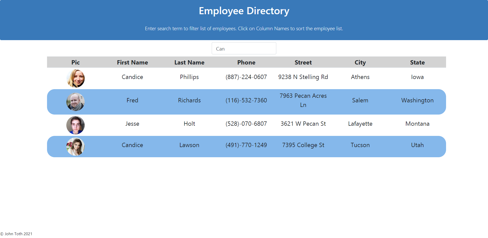
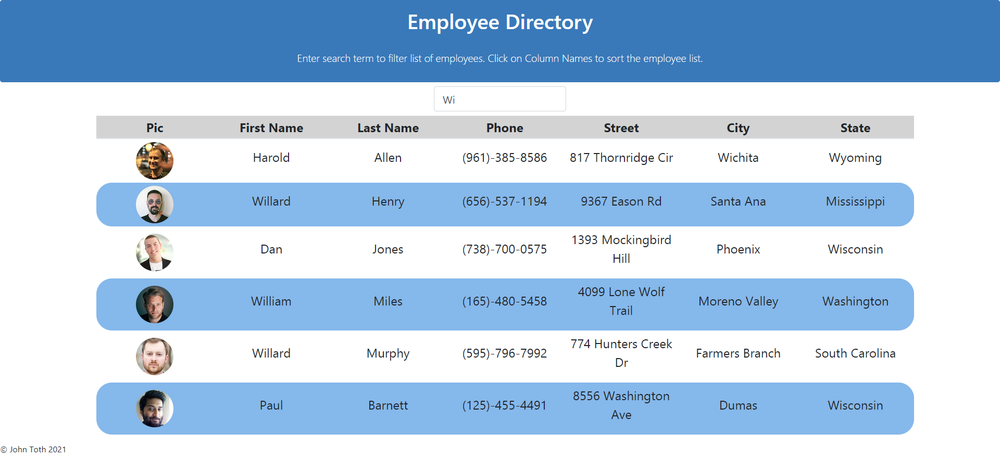

# employee_directory

The Employee Directory is an application that displays a list of employee information and permits the user to search on any field displayed (first/last name, address, city, state, phone number).  The user is also able to click any of the column names in the employee directory and the table is sorted in ascending or descending order by that column name.  Click the same column name again reverses the sort order.  The employee directory is refreshed with a new list of employees every time the page is reloaded.  As the user types a search term and the list is filtered, clicking a column name will sort the resulting data set.

This application was built using React and utilizes component state.  The employee data is retrieved from a 3rd party API (randomuser.me)  The application was deployed to Github pages..

## Table of Contents
* [Screenshots](#Screenshots)
* [Installation](#Installation)
* [Usage](#Usage)
* [Technologies](#Technologies)
* [Repository](#Repository)
* [Deployment](#Deployment)

#### Employee Directory filtered
The following is a screenshot of the Employee Directory after a search is performed.

  

#### Employee Directory Sorted (Ascending)
The following is a screenshot of the Employee Directory after an ascending sort is performed on Last Name.

  

#### Employee Directory Sorted (Descending)
The following is a screenshot of the Employee Directory after a descending sort is performed on City.

  

## Installation

* Fork or clone the repo.
* Make sure to install all the depedencies by running the following command:
    * **npm install**

## Usage

To use this application once installed, the user launches the application from a terminal window as follows:

**npm start**

This will then open a browser window at localhost:3000.

The application can alternatively be run as a deployed application following the link in the Deployment section.

## Technologies

* React
* axios
* Github pages
* Bootstrap
* HTML
* CSS
* Javascript

## Repository

Direct link to repository:  https://github.com/jtoth7824/employee_directory

## Deployment

The Employee Directory application was deployed to Github Pages so that anyone can run the application.   The link to execute the application is as follows:

https://jtoth7824.github.io/employee_directory

